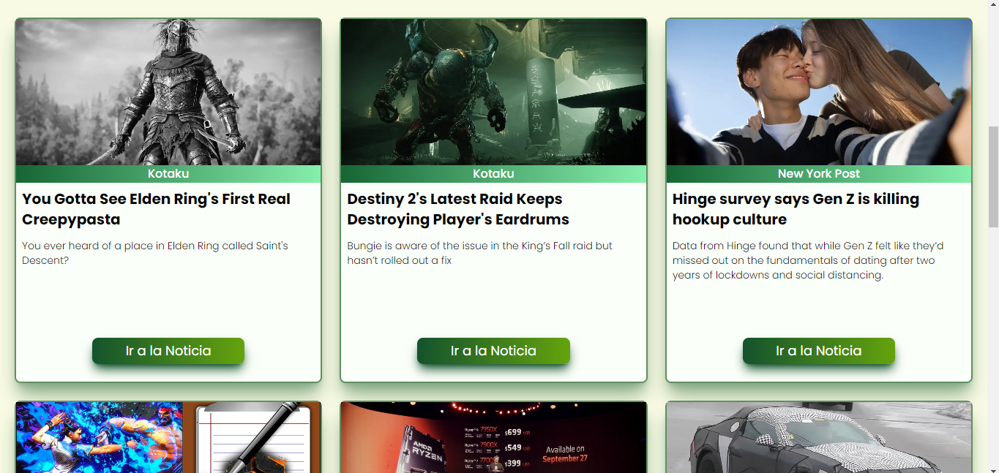

# News app

info news app was built with React, JavaScript, Tailwind, react icons and react-router-dom for the routes.
for the animations i used lottie files.

## Api

For the data request i used [https://gnews.io/](https://gnews.io/)

## Screenshots

---

## Link

Info news site: [https://news-app-with-react.vercel.app](https://news-app-with-react.vercel.app)

## Built with

- React
- Javascript
- Tailwind
- react-hooks
- react icons
- react-router-dom
